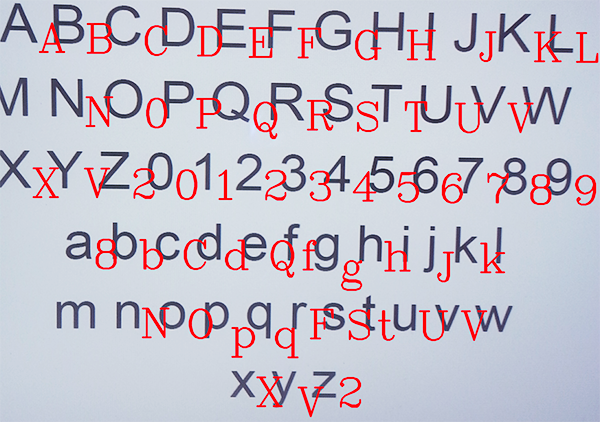

<p align="center">
 OcrProject
</p>

[](http://forthebadge.com)
<br>

This is Android library for recognition of typed characters. 
Initially it was built to recognize numbers but later upgraded to recognize letters of the English alphabet.

## Usage

* **Initialization**
```java
    /**
     * @param context application context
     * @param onlyNumbers set to true if you want to recognize only numbers, false if recognition of all characters is needed
     */
  Detector.init(getApplicationContext(), true);

```

* **Setting aditional parameters**
```java
   
   /**
    * set to true if image is rotated 90 degrees (most of Android phones return rotated image)
    */
   Detector.setImageFliped(true );
   
   /**
    * threshold for character recognition (0-100%)
    * smaller threshold returns more detected numbers, but more false positives and vice versa
    */
   Detector.setCertainty(40);
```

* **Detecting characters**
```java
    /*
    * detection input is bitmap image and result is map of detected characters 
    * and their postions in image.
    */
   Map<Point, String> result = Detector.detect(bitmapImage);
```


* **If you want to detect numbers use line below to parse result to double values**
```java
  Map<Point, Double> numbersResult = Detector.getNumbers(result);
```

If you are trying to recognize Eg. number 0.9375, detect() method will return:
```java
{Point(1741, 1756)=7, Point(1854, 1762)=5, Point(1320, 1740)=0, Point(1370, 1743)=., Point(1617, 1751)=3, Point(1505, 1748)=9}
```

While getNumbers() method will turn this result to:
```java
 {Point(1320, 1740)=0.9375}
```


## Examples

* Number recognition


* Character recognition

Library is upgraded to recognize characters but with with reduced accuracy due to lack of training samples.




Download
--------

```groovy
dependencies {
   compile 'com.adrianzgaljic.ocr:ocr:0.9.0'
}
```
